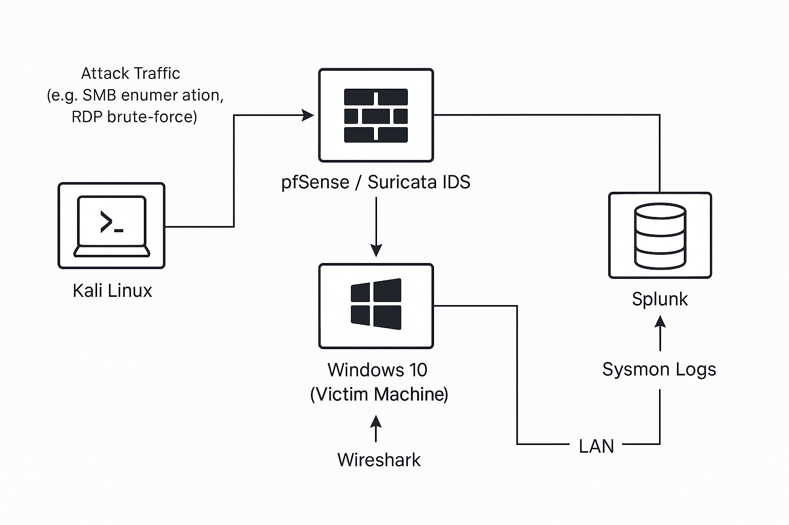

# Threat-Detection-Lab

## 🛡️ Overview
This project simulates a monitored network with:
- pfSense firewall and Suricata IDS
- Splunk for centralized log aggregation
- Kali Linux for offensive operations
- Windows 10 as the monitored target

## 🧰 Tools Used
- pfSense + Suricata IDS
- Splunk Enterprise (Universal Forwarder configuredon on Windows VM)
- Sysmon on Windows VM
- Wireshark packet captures
- Kali Linux for attack simulation

## ⚔️ Attacks Conducted
1. **Nmap SYN Scan**
2. **Aggressive Nmap Scan**
3. **PowerShell HTTP Payload Simulation**
4. **SMB Brute-force Attempt with Hydra**
5. **Procdump LSASS Dump Attempt**

## 📊 Detection Highlights
- Suricata alerts visible for port scans & Python HTTP server
- Sysmon logs forwarded to Splunk successfully
- Wireshark confirmed network traffic during attacks

## 🗺️ Network Diagram

